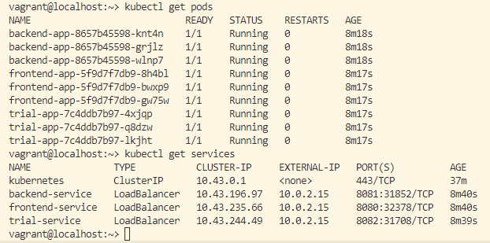
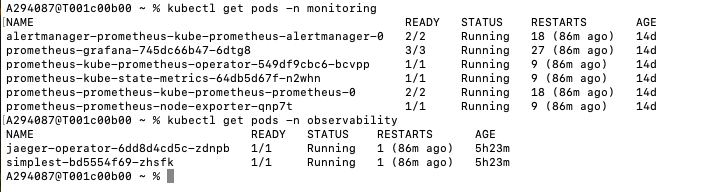
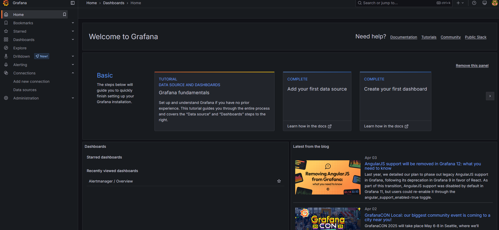
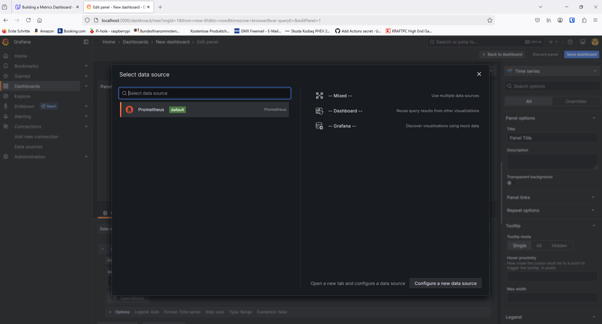
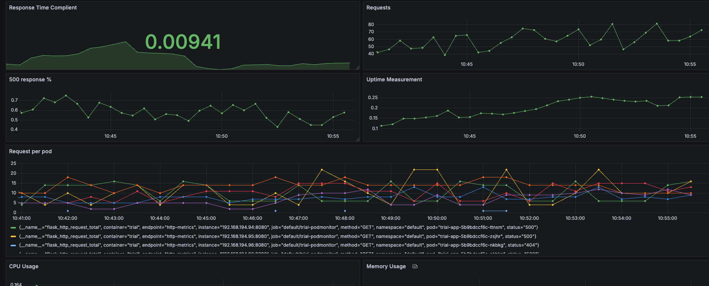
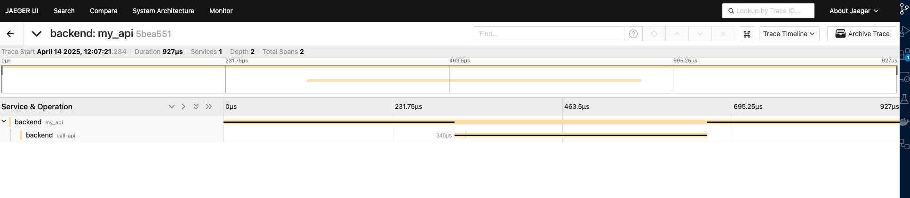
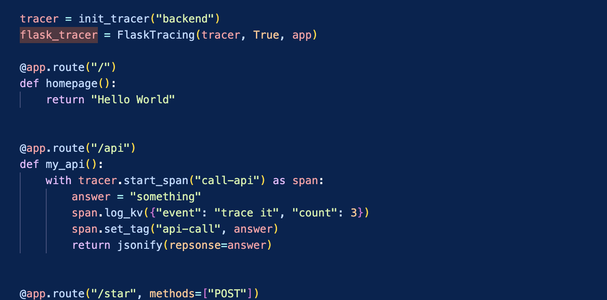
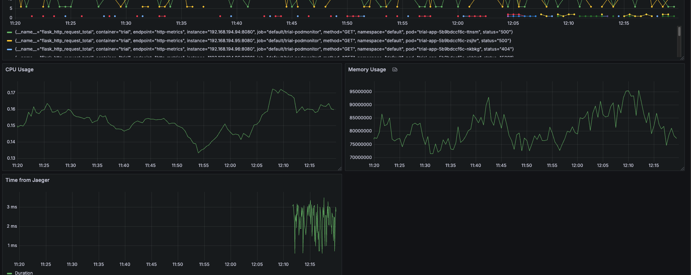
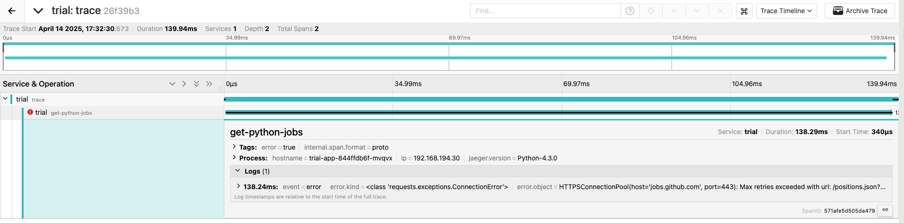
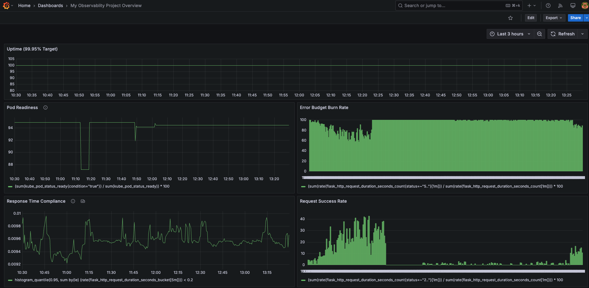

**Note:** For the screenshots, you can store all of your answer images in the `answer-img` directory.

## Verify the monitoring installation

run `kubectl` command to show the running pods and services for all components. Take a screenshot of the output and include it here to verify the installation
### Pods and services of application
 

### Pods on monitoring and observability namespace
 

## Setup the Jaeger and Prometheus source
Expose Grafana to the internet and then setup Prometheus as a data source. Provide a screenshot of the home page after logging into Grafana.
### picture
 

## Create a Basic Dashboard
Create a dashboard in Grafana that shows Prometheus as a source. Take a screenshot and include it here.
### picture
 

## Describe SLO/SLI
Describe, in your own words, what the SLIs are, based on an SLO of *monthly uptime* and *request response time*.
### SLO "monthly uptime"
To measure the "monthly uptime" it is nessecary to a SLI metric that evaluates the uptime of the serives and pods.
### SLO "request response time"
To measure the "request response time" a SLI to define a threshold like 200 ms, and then identify how often in percentage this threshold is meet.

## Creating SLI metrics.

### Uptime measurement
To measure the uptime, the uptime of the services will be measured, should be above 98%

### Response Time Compliance
Here is to measure the response time following the SLO target to have 95% requests ≤ 200ms.

### Error Budget Burn Rate
We check the slo violations based on the # of requests. 500 http responses shoud be < 3%

### Pod Readiness
The time that the pods are ready for the given serives shall be above 98%.

### Request Rate
Regualar have the # of requests shown on a dashboard, there is no limit assigned with this, since this hopefully will always grow as our company will grow.

## Create a Dashboard to measure our SLIs
 

## Tracing our Flask App

 

  

## Jaeger in Dashboards

## Report Error

TROUBLE TICKET

Name: Uwe Sülter

Date: 14.04.2025

Subject: Implementation of /trace is broken 

Affected Area: Start page

Severity: high

Description:
On the start page, the integration of the trial app is broken. Whenever the endpoint for /trace is called, the system shows a 500 error. Please have a look on our dashboard: project3-dashboard. It shows clearly a high number of 500 errors in % of all responses as you can see on the "500 response %" visualisation. Please look at the given trace:

## Creating SLIs and SLOs

For a 99.95% monthly uptime SLO, four essential SLIs would be:
### HTTP Success Rate
(Successful HTTP responses / Total requests) × 100
Measures the percentage of requests returning 2xx/3xx status codes. Critical for detecting service outages.
### Pod Readiness Ratio
(Ready pods / Total desired pods) × 100
Tracks availability of application instances. Kubernetes-native metric via kube_pod_status_ready.
### Error Budget Consumption Rate
(Error count / Total allowed errors) × 100
Monitors how quickly errors eat into the 0.05% allowable downtime.
### Synthetic Health Check Success
(Successful synthetic probes / Total probes) × 100
Simulates user traffic to detect silent failures.
## Building KPIs for our plan

|SLI Metric| KPI| Rationale|
|--------------|--------------|---------------|
|HTTP Success Rate|30-day rolling success percentage , 5-minute error spike alerts|Provides trend analysis while enabling rapid response to outages|
|Pod Readiness|Cluster-wide readiness %, Pod restart count per hour|Combines availability tracking with instability detection|
|Error Budget|Daily burn rate, Remaining error budget days|Visualizes compliance trajectory and risk exposure|

## Final Dashboard
 

 ### Uptime (99.95% Target)
Percentage of time the service is up. Tracks the percentage of time your service is operational, ensuring it meets the uptime SLO.

 ### Pod Readiness
 Percentage of pods ready for use. Tracks pod availability to ensure service reliability.

 ### Error Budget Burn Rate
Rate at which the error budget is consumed. Helps track how quickly errors are consuming the allowable error budget.
 ### Response Time Compliance
 Percentage of requests with latency ≤ 200ms. Ensures that most requests meet the response time SLO.

 ### Request Success Rate
Percentage of successful HTTP responses (2xx status codes). Monitors how often requests are successfully handled, ensuring compliance with error budget limits.