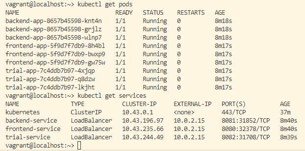
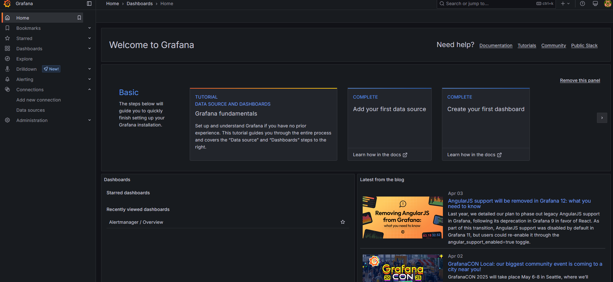
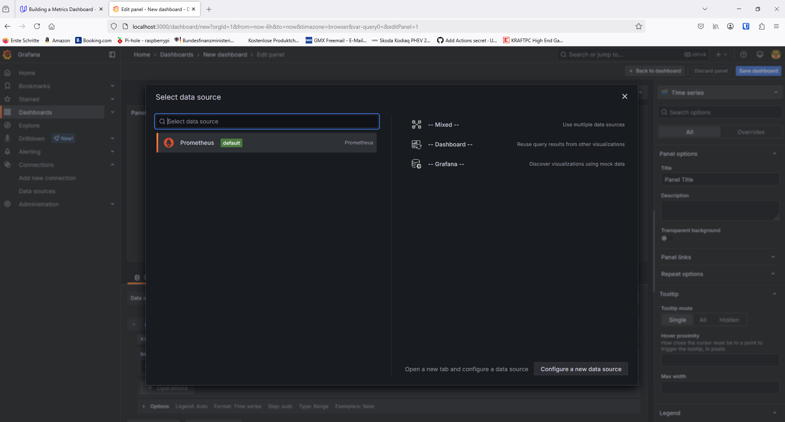

**Note:** For the screenshots, you can store all of your answer images in the `answer-img` directory.

## Verify the monitoring installation

run `kubectl` command to show the running pods and services for all components. Take a screenshot of the output and include it here to verify the installation
### picture
 
### text ouput
```
kubectl get pods
NAME                            READY   STATUS    RESTARTS   AGE
backend-app-8657b45598-knt4n    1/1     Running   0          8m18s
backend-app-8657b45598-grjlz    1/1     Running   0          8m18s
backend-app-8657b45598-wlnp7    1/1     Running   0          8m18s
frontend-app-5f9d7f7db9-8h4bl   1/1     Running   0          8m17s
frontend-app-5f9d7f7db9-bwxp9   1/1     Running   0          8m17s
frontend-app-5f9d7f7db9-gw75w   1/1     Running   0          8m17s
trial-app-7c4ddb7b97-4xjqp      1/1     Running   0          8m17s
trial-app-7c4ddb7b97-q8dzw      1/1     Running   0          8m17s
trial-app-7c4ddb7b97-lkjht      1/1     Running   0          8m17s

kubectl get services
NAME               TYPE           CLUSTER-IP     EXTERNAL-IP   PORT(S)          AGE
kubernetes         ClusterIP      10.43.0.1      <none>        443/TCP          37m
backend-service    LoadBalancer   10.43.196.97   10.0.2.15     8081:31852/TCP   8m40s
frontend-service   LoadBalancer   10.43.235.66   10.0.2.15     8080:32378/TCP   8m40s
trial-service      LoadBalancer   10.43.244.49   10.0.2.15     8082:31708/TCP   8m39s
```
## Setup the Jaeger and Prometheus source
Expose Grafana to the internet and then setup Prometheus as a data source. Provide a screenshot of the home page after logging into Grafana.
### picture
 

## Create a Basic Dashboard
Create a dashboard in Grafana that shows Prometheus as a source. Take a screenshot and include it here.
### picture
 

## Describe SLO/SLI
Describe, in your own words, what the SLIs are, based on an SLO of *monthly uptime* and *request response time*.
### SLO "monthly uptime"
To measure the "monthly uptime" it is nessecary to a SLI metric that evaluates the uptime of the serives and pods.
### SLO "request response time"
To measure the "request response time" a SLI to define a threshold like 200 ms, and then identify how often in percentage this threshold is meet.

## Creating SLI metrics.
*TODO:* It is important to know why we want to measure certain metrics for our customer. Describe in detail 5 metrics to measure these SLIs. 

## Create a Dashboard to measure our SLIs
*TODO:* Create a dashboard to measure the uptime of the frontend and backend services We will also want to measure to measure 40x and 50x errors. Create a dashboard that show these values over a 24 hour period and take a screenshot.

## Tracing our Flask App
*TODO:*  We will create a Jaeger span to measure the processes on the backend. Once you fill in the span, provide a screenshot of it here. Also provide a (screenshot) sample Python file containing a trace and span code used to perform Jaeger traces on the backend service.

## Jaeger in Dashboards
*TODO:* Now that the trace is running, let's add the metric to our current Grafana dashboard. Once this is completed, provide a screenshot of it here.

## Report Error
*TODO:* Using the template below, write a trouble ticket for the developers, to explain the errors that you are seeing (400, 500, latency) and to let them know the file that is causing the issue also include a screenshot of the tracer span to demonstrate how we can user a tracer to locate errors easily.

TROUBLE TICKET

Name:

Date:

Subject:

Affected Area:

Severity:

Description:


## Creating SLIs and SLOs
*TODO:* We want to create an SLO guaranteeing that our application has a 99.95% uptime per month. Name four SLIs that you would use to measure the success of this SLO.

## Building KPIs for our plan
*TODO*: Now that we have our SLIs and SLOs, create a list of 2-3 KPIs to accurately measure these metrics as well as a description of why those KPIs were chosen. We will make a dashboard for this, but first write them down here.

## Final Dashboard
*TODO*: Create a Dashboard containing graphs that capture all the metrics of your KPIs and adequately representing your SLIs and SLOs. Include a screenshot of the dashboard here, and write a text description of what graphs are represented in the dashboard.  
